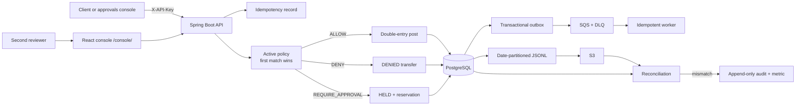

# Teller


> **Scope.** Teller is a *simulated* payments core built as a portfolio project. It moves no real money, connects to no payment rails or banks, and every account, transfer and currency in its examples is synthetic. Its purpose is to show how a policy-gated double-entry ledger is built and proven correct on the Java / Spring Boot / PostgreSQL / AWS stack.

Teller is a Java 21/Spring Boot payments core with a policy gate. It keeps money as `long` minor units plus ISO-4217 currency, posts balanced double-entry ledger rows, reserves funds for four-eyes approval, and checks its correctness under seeded transport and process faults.

## Problem

A transfer API has to answer two questions atomically: “may this payment proceed?” and “what happened to the money?” A policy allow must post once, a deny must move nothing, and an approval hold must reduce spendable funds without changing the ledger until a second reviewer acts. Timeouts, duplicate messages, process crashes, concurrent debits, and expired reviews cannot create money or strand a reservation.

Teller deliberately remains a demo payments core. It does not connect to card networks, banks, customer data, or real payment rails.

## Architecture



The API, SQS worker, outbox relay, approval expiry, export, reconciliation scheduler, and built React console run in one image. PostgreSQL is authoritative. SQS is at-least-once transport, S3 holds immutable per-run entry and audit exports, and CDK defines seven separately deployable stacks.

Rules can match amount bounds, currency, per-source velocity, counterparty allow/deny lists, and a four-eyes threshold. Lower precedence numbers run first; no match is a deny.

## Correctness

Money is never represented as floating point. Each `Money` value is a signed-safe Java `long` count of minor units and a three-letter ISO currency. A transfer locks both accounts in UUID order, checks currency and available funds, and commits its decision, ledger effects, approval, audit, and outbox state transactionally.

Every posting has one currency and at least two rows. PostgreSQL deferred constraint triggers reject a posting whose signed credits minus debits is non-zero at commit. Reversal of a posted transfer appends compensating rows; immutable entries are never edited.

The seeded simulator drives the real transfer, policy, approval, expiry, idempotency, outbox, and worker services through an in-memory port layer, virtual clock, and fault-injecting bus. It checks after every step and again after quiescence:

1. Entry sums are zero per currency and per posting.
2. Each account ledger balance equals the sum of its customer-facing posted entries.
3. Available balance equals ledger balance minus active `HELD` reservations.
4. No account becomes negative without an overdraft-permitting rule; the current rule model does not permit overdrafts.
5. Every held transfer ends `POSTED` or `REVERSED`, and its reservation is consumed or released exactly once.
6. Replaying an idempotent transfer request creates neither a second transfer nor second entries.
7. Audit records remain append-only and ordered per aggregate.
8. Every outbox row is sent and has exactly one consumer effect despite duplicate or reordered delivery.

The latest verified 200-seed run generated `target/sim-coverage.json` in **2,093 ms** and recorded **46,663 steps** and **6,879 transfers**: 4,320 denied, 1,959 posted, and 600 reversed. It injected 453 crashes after commit, 466 crashes before commit, 299 delays, 256 drop/redeliveries, 332 duplicates, 327 reorderings, and 120 visibility redeliveries. `-Dsim.seed=<n>` reruns one scenario and prints its trace if an invariant fails.

The harness found a real ledger defect during development. Demo deposits updated `accounts.ledger_balance_minor` and `available_balance_minor` and wrote an audit row, but wrote **zero ledger entries**. A funded account therefore had a cached ledger balance of 10,000 while the sum of its posted entries was 0. Deposits now append one customer credit and one external-funding debit under a shared posting ID, restoring both account reconstruction and global conservation.

Reconciliation runs in a PostgreSQL repeatable-read transaction, exports entries and audit into unique immutable keys below `entries/dt=YYYY-MM-DD/` and `audit/dt=YYYY-MM-DD/`, then compares exact entry identities/content, row counts, per-currency debit/credit amounts, and every cached account ledger balance. A mismatch persists a run, appends `RECONCILIATION_MISMATCH`, and increments `teller.reconciliation.mismatch`.

## Exactly-once

Transport is at least once; Teller makes each observable effect idempotent:

| Mechanism | Protects against | Result |
|---|---|---|
| `Idempotency-Key` on `POST /transfers` | Client timeout and retry | Same key and canonical body return the stored transfer; a changed body returns 409. |
| Transfer transaction | Partial policy or money state | Decision, transfer, entries or reservation, audit, approval, and outbox commit together. |
| Transactional outbox | Commit followed by failed SQS publish | The durable row remains pending until publish succeeds. |
| Stable outbox message ID | SQS transport IDs changing | Retries and DLQ replay retain one logical identity. |
| `processed_messages` transaction | Duplicate delivery | Message claim and effect commit together; a duplicate has no second effect. |
| Immutable ledger postings | Retry or reversal ambiguity | Reversals compensate; posted rows are never updated or deleted. |
| Audited DLQ replay | Poison messages | Operators fix the cause and replay through a protected endpoint. |

## Performance

> **LEAD CAPTURE PLACEHOLDER:** AWS k6 measurements have not been captured for Teller yet. The lead will replace this block with throughput, latency percentiles, error count, ECS CPU/memory, and RDS CPU/connections from the same captured run. No live performance number is claimed here.

`load/transfers.js` creates a synthetic USD policy and pair of accounts in `setup()`, funds the source, then posts a repeatable mix of 4,000-unit `ALLOW`, 6,000-unit `REQUIRE_APPROVAL`, and 12,000-unit `DENY` transfers with unique idempotency keys. It refuses to run unless the operator explicitly confirms an isolated demo target:

```bash
BASE_URL='http://<task-public-ip>:8080' API_KEY='<api-key>' \
  CONFIRM_DEMO_TARGET=true k6 run load/transfers.js
```

## Operations

Micrometer exposes these application metrics through the protected Actuator metrics API:

| Metric | Meaning |
|---|---|
| `teller.transfers.terminal{state=DENIED|POSTED|REVERSED}` | Current transfer count by terminal state |
| `teller.reservations.active` | Current count of `HELD` transfer reservations |
| `teller.reconciliation.mismatch` | Reconciliation mismatch counter |
| `teller.outbox.sent`, `teller.outbox.failed` | Outbox relay outcomes |

The CDK service stack creates the `Teller` dashboard for HTTP 5xx, approval DLQ depth, ECS CPU/memory, and RDS CPU/connections. `teller-http-5xx` alarms after five server errors in five minutes; `teller-approval-dlq-depth` alarms as soon as one message is visible. Recovery and audited replay steps are in [docs/runbook.md](docs/runbook.md).

## Cost

The resource shape and pricing basis are the same as AgentOps Gate: us-east-1 on-demand pricing captured 2026-08-29.

| Resource | Unit price | Always-on / month (730 h) | Per day while deployed |
|---|---:|---:|---:|
| ECS Fargate task, 0.25 vCPU + 0.5 GB | $0.040478/vCPU-h + $0.004446/GB-h = $0.01234/h | $9.01 | $0.30 |
| RDS db.t4g.micro, PostgreSQL, Single-AZ | $0.016/h | $11.68 | $0.38 |
| RDS storage, 20 GB gp3 | $0.115/GB-mo | $2.30 | $0.08 |
| Secrets Manager, two secrets | $0.40/secret-mo | $0.80 | $0.03 |
| SQS, S3, CloudWatch, ECR at demo volume | metered, approximately free-tier scale | ≈ $0.50 | ≈ $0.02 |
| **Total** | | **≈ $24.3** | **≈ $0.80** |

The $10/month operating ceiling therefore requires deploying for capture or demos and running `cdk destroy --all` between them—approximately 12 deployed days per month before the Budgets alert. NAT gateways and an Application Load Balancer are intentionally absent.

## Deployment

The CDK app defines `TellerGithubOidcStack`, `TellerNetworkStack`, `TellerDataStack`, `TellerQueueStack`, `TellerBucketStack`, `TellerServiceStack`, and `TellerBudgetStack`. Named resources use `teller-*`: ECR repository `teller`, queues `teller-approvals*`, bucket `teller-audit-<account>-<region>`, secrets, ECS service/task/cluster, database, alarms, and application log group.

Build the console before the Maven package so its Vite output is copied into `BOOT-INF/classes/static/console`:

```bash
npm --prefix console ci
npm --prefix console test -- --run
npm --prefix console run build
./mvnw -o -q test
./mvnw -o -q -DskipTests package
```

Synthesize or deploy with an existing `teller` ECR image tag:

```bash
cd infra
npx tsc --noEmit
npx cdk synth
npx cdk deploy --all --require-approval never \
  -c imageTag='<existing-ecr-image-tag>' \
  -c budgetEmail='alerts@example.test'
```

The VPC uses public subnets without NAT. Fargate receives a public IP for AWS APIs; RDS is not publicly accessible and allows PostgreSQL only from the task security group. Runtime credentials come from the ECS task role and `teller-*` Secrets Manager values.

## API

All JSON routes require `X-API-Key`; transfer creation also requires `Idempotency-Key`. `/actuator/health` and static `/console/**` assets are public so the login shell can load, but the console keeps its API key only in React memory and every data request remains protected.

| Method | Path | Purpose |
|---|---|---|
| `POST` | `/accounts` | Open an account in one ISO currency |
| `GET` | `/accounts/{id}` | Read cached ledger/available balances, status, and version |
| `POST` | `/accounts/{id}/deposits` | Add synthetic demo funding as a balanced posting |
| `POST` | `/transfers` | Evaluate policy and create a transfer; requires `Idempotency-Key` |
| `GET` | `/transfers/{id}` | Read transfer state, decision, approval, and timestamps |
| `POST` | `/transfers/{id}/reverse` | Release a hold or append compensation for a posted transfer |
| `POST` | `/policies` | Create and activate a policy version |
| `POST` | `/policies/{id}/rules` | Add an ordered money-aware rule |
| `POST` | `/decisions` | Retained generic policy-gate API; requires `Idempotency-Key` |
| `GET` | `/decisions/{id}` | Read an immutable decision and matched rule |
| `GET` | `/approvals?status=PENDING` | List approvals by status, oldest first; the console joins transfer-backed rows |
| `GET` | `/approvals/{id}/transfer` | Read held transfer context and matched rule for review |
| `POST` | `/approvals/{id}/approve` | Approve and post; optional API `reason`, required by console |
| `POST` | `/approvals/{id}/deny` | Deny and release; optional API `reason`, required by console |
| `GET` | `/audit?from=&to=` | Query audit records newest first in a UTC range |
| `POST` | `/admin/exports/daily?date=` | Export entry and audit JSONL partitions |
| `POST` | `/admin/reconciliation?date=` | Export and reconcile a UTC day immediately |
| `GET` | `/admin/reconciliation/latest` | Read the latest persisted reconciliation run |
| `POST` | `/admin/dlq/replay?limit=` | Replay up to ten approval DLQ messages |
| `GET` | `/console/` | Load the approvals console static shell |

Invalid input returns RFC 9457 `application/problem+json`; unauthorized requests return 401, missing resources 404, and invalid transitions or idempotency conflicts 409.

## Run locally

Prerequisites: Docker Compose, Node 22+, `curl`, `jq`, and `uuidgen`.

```bash
npm --prefix console run build
export POSTGRES_USER=teller
export POSTGRES_PASSWORD='choose-a-local-password'
export TELLER_API_KEY='choose-a-local-api-key'
docker compose up --build -d --wait
curl --fail http://localhost:8080/actuator/health
```

Open `http://localhost:8080/console/` and enter the same API key, or use the API walkthrough below.

Create two USD accounts and fund the source with 30,000 minor units:

```bash
export SOURCE_ID="$(curl --fail-with-body -sS -X POST http://localhost:8080/accounts \
  -H "X-API-Key: $TELLER_API_KEY" -H 'Content-Type: application/json' \
  -d '{"currency":"USD"}' | jq -r '.id')"
export DESTINATION_ID="$(curl --fail-with-body -sS -X POST http://localhost:8080/accounts \
  -H "X-API-Key: $TELLER_API_KEY" -H 'Content-Type: application/json' \
  -d '{"currency":"USD"}' | jq -r '.id')"
curl --fail-with-body -sS -X POST "http://localhost:8080/accounts/$SOURCE_ID/deposits" \
  -H "X-API-Key: $TELLER_API_KEY" -H 'Content-Type: application/json' \
  -d '{"amountMinor":30000}' | jq
```

Create an active first-match policy: deny above 10,000, require four eyes above 5,000, then allow through 5,000.

```bash
export POLICY_ID="$(curl --fail-with-body -sS -X POST http://localhost:8080/policies \
  -H "X-API-Key: $TELLER_API_KEY" -H 'Content-Type: application/json' \
  -d '{"name":"teller-demo","version":1}' | jq -r '.id')"
curl --fail-with-body -sS -X POST "http://localhost:8080/policies/$POLICY_ID/rules" \
  -H "X-API-Key: $TELLER_API_KEY" -H 'Content-Type: application/json' \
  -d '{"toolNameGlob":"ledger.transfer","amountMin":10001,"currency":"USD","effect":"DENY","precedence":10}' | jq
curl --fail-with-body -sS -X POST "http://localhost:8080/policies/$POLICY_ID/rules" \
  -H "X-API-Key: $TELLER_API_KEY" -H 'Content-Type: application/json' \
  -d '{"toolNameGlob":"ledger.transfer","fourEyesAbove":5000,"currency":"USD","effect":"REQUIRE_APPROVAL","precedence":20}' | jq
curl --fail-with-body -sS -X POST "http://localhost:8080/policies/$POLICY_ID/rules" \
  -H "X-API-Key: $TELLER_API_KEY" -H 'Content-Type: application/json' \
  -d '{"toolNameGlob":"ledger.transfer","amountMax":5000,"currency":"USD","effect":"ALLOW","precedence":30}' | jq
```

Exercise `ALLOW` and `DENY`:

```bash
curl --fail-with-body -sS -X POST http://localhost:8080/transfers \
  -H "X-API-Key: $TELLER_API_KEY" -H "Idempotency-Key: $(uuidgen)" \
  -H 'Content-Type: application/json' \
  -d "{\"fromAccountId\":\"$SOURCE_ID\",\"toAccountId\":\"$DESTINATION_ID\",\"amountMinor\":4000,\"currency\":\"USD\",\"initiatedBy\":\"demo-maker\"}" | jq
curl --fail-with-body -sS -X POST http://localhost:8080/transfers \
  -H "X-API-Key: $TELLER_API_KEY" -H "Idempotency-Key: $(uuidgen)" \
  -H 'Content-Type: application/json' \
  -d "{\"fromAccountId\":\"$SOURCE_ID\",\"toAccountId\":\"$DESTINATION_ID\",\"amountMinor\":12000,\"currency\":\"USD\",\"initiatedBy\":\"demo-maker\"}" | jq
```

Create a held transfer, approve it with a reason, inspect balances, then reverse it:

```bash
export HELD_JSON="$(curl --fail-with-body -sS -X POST http://localhost:8080/transfers \
  -H "X-API-Key: $TELLER_API_KEY" -H "Idempotency-Key: $(uuidgen)" \
  -H 'Content-Type: application/json' \
  -d "{\"fromAccountId\":\"$SOURCE_ID\",\"toAccountId\":\"$DESTINATION_ID\",\"amountMinor\":6000,\"currency\":\"USD\",\"initiatedBy\":\"demo-maker\"}")"
export HELD_TRANSFER_ID="$(echo "$HELD_JSON" | jq -r '.id')"
export APPROVAL_ID="$(echo "$HELD_JSON" | jq -r '.approvalId')"
curl --fail-with-body -sS -X POST "http://localhost:8080/approvals/$APPROVAL_ID/approve" \
  -H "X-API-Key: $TELLER_API_KEY" -H 'Content-Type: application/json' \
  -d '{"decidedBy":"demo-checker","reason":"Invoice and beneficiary verified"}' | jq
curl --fail-with-body -sS "http://localhost:8080/accounts/$SOURCE_ID" -H "X-API-Key: $TELLER_API_KEY" | jq
curl --fail-with-body -sS "http://localhost:8080/accounts/$DESTINATION_ID" -H "X-API-Key: $TELLER_API_KEY" | jq
curl --fail-with-body -sS -X POST "http://localhost:8080/transfers/$HELD_TRANSFER_ID/reverse" \
  -H "X-API-Key: $TELLER_API_KEY" -H 'Content-Type: application/json' \
  -d '{"reasonCode":"DEMO_REVERSAL"}' | jq
```

After the 4,000-unit allow and 6,000-unit approved transfer, source ledger/available are 20,000 and destination ledger/available are 10,000. Reversing the 6,000-unit transfer restores them to 26,000 and 4,000.

## Tests

Frontend tests and build use only the committed lockfile and installed packages:

```bash
npm --prefix console test -- --run
npm --prefix console run build
```

Pure Java, jqwik, simulation, and compilation run offline without Docker:

```bash
./mvnw -o -q -Dtest='MoneyTest,AccountLedgerTest,TransferStateMachineTest,ApprovalStateMachineTest,ApprovalServiceTest,ApprovalQueueServiceTest,TellerMetricsTest,IdempotencyServiceTest,MoneyRulesEngineProperties,RulesEngineTest,RulesEngineProperties,SimulationTest,AuditExportServiceTest,EntryExportServiceTest,ReconciliationComparatorTest,ReconciliationServiceTest,S3AuditObjectStoreTest,AwsApprovalQueuePublisherTest,ApprovalMessageCodecTest,ApprovalQueueWorkerTest,OutboxRelayTest,ApprovalMessageValidatorTest,DlqReplayTest,HttpRequestLoggingFilterTest,ApiKeyFilterTest,AwsClientConfigurationTest,ConsoleControllerTest,ApprovalControllerResponseTest' -Dsurefire.failIfNoSpecifiedTests=false test
./mvnw -o -q -Dtest=SimulationTest -Dsim.seeds=2000 -Dsurefire.failIfNoSpecifiedTests=false test
./mvnw -o -q -DskipTests package
```

On a Docker host, the complete suite adds PostgreSQL and LocalStack coverage for migrations, deferred ledger triggers, policy effects, concurrent draining, expiry, idempotency, SQS/DLQ behavior, immutable S3 exports, and reconciliation:

```bash
./mvnw -o -q test
```

## What was left out

- Real payment rails, card or bank connectivity
- KYC, sanctions screening, and customer identity data
- FX and multi-currency conversion
- Production overdraft products
- OAuth and fine-grained reviewer authorization
- Kafka, Kubernetes, and multi-region deployment
- NAT gateways, an Application Load Balancer, and a separate console hosting stack

These would materially expand regulatory, security, operational, or cost scope without strengthening the ledger and policy-gate proof demonstrated here.

## Status

As of 2026-08-29, Tasks A–D are committed and passed **86/86 tests with Docker** at `fc73b50`. This Task E/Task F working tree adds the approvals console, approval reasons/join endpoints, Teller metrics, named CDK resources, alarms/dashboard, runbook, load script, and case-study documentation. Its offline gates are documented above; the lead still owns the Docker rerun and AWS performance/chaos capture. The repository remains local until its owner chooses to publish it.
