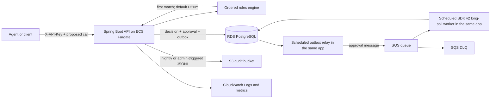

# AgentOps Gate

AgentOps Gate is a small policy and approval service for AI tool calls. An agent proposes a call; the service evaluates an ordered policy and returns `ALLOW`, `DENY`, or `REQUIRE_APPROVAL`. It never executes the proposed tool itself.

Approval-required decisions create a pending approval and transactional outbox row; a scheduled relay publishes the row to SQS after commit. Decisions and audit records are immutable, approval transitions are constrained, and audit records can be exported as date-partitioned JSON Lines objects in S3.

## Status

- Local: `docker compose up` runs the full flow (policy → rules → three decisions → approval over SQS → audit → S3 export) against Postgres and LocalStack; 58 tests span pure unit, PostgreSQL, and LocalStack coverage.
- AWS: the CDK stacks synthesize; **not yet deployed** — the deploy pipeline and the cost figure below are exercised in the Day-2 step. Nothing in this README that depends on a live AWS environment should be read as verified until this line changes.

## Architecture



The rules engine is a plain Java class. It sorts rules by ascending precedence, stops at the first complete match, and defaults to `DENY`. Matchers are optional except for the tool-name glob; supported dimensions are tool glob (`fs.*` and `*`), argument regex, exact agent ID, and risk tier.

The application uses AWS SDK v2 directly. Spring Cloud AWS 3.4 is compiled against a Spring Boot 3 `PropertyMapper` API that Boot 4 removed, so keeping it would leave a binary-incompatible runtime. Explicit `SqsClient` and `S3Client` beans mean one fewer abstraction and make region, credentials, endpoint overrides, and LocalStack path-style access visible in ordinary Spring configuration.

The scheduled SQS worker long-polls for 20 seconds, processes each message, and deletes its receipt only after the database transaction commits. A failure leaves the message for visibility-timeout retry and eventual DLQ redrive. Every approval envelope carries the stable outbox UUID as its `messageId`; the `processed_messages` claim and approval state change share one transaction, so retries and DLQ replays remain no-ops even when SQS assigns a new transport ID. The independent scheduled expiry sweep covers approvals even when a message is delayed or unavailable.

The decision, approval, audit rows, and outbox message commit together. The relay locks at most 50 pending rows with `FOR UPDATE SKIP LOCKED`; successful sends record `sent_at`, while failures retain the row with an attempt count and error for retry. Publishing is therefore at-least-once, with duplicate effects removed by the consumer transaction.

## API

All API routes except `/actuator/health` require `X-API-Key`. `POST /decisions` also requires a non-blank `Idempotency-Key`; replaying the same canonical JSON body returns the stored response with 200, while reusing the key for a different body returns 409.

| Method | Path | Purpose |
|---|---|---|
| `POST` | `/policies` | Create a versioned policy |
| `POST` | `/policies/{id}/rules` | Append a rule at a precedence |
| `POST` | `/decisions` | Evaluate and persist a proposed call; requires `Idempotency-Key` |
| `GET` | `/decisions/{id}` | Read an immutable decision |
| `POST` | `/approvals/{id}/approve` | Approve a pending approval |
| `POST` | `/approvals/{id}/deny` | Deny a pending approval |
| `GET` | `/audit?from=&to=` | Query the append-only audit stream |
| `POST` | `/admin/exports/audit?date=` | Export one UTC day to S3 immediately |
| `POST` | `/admin/dlq/replay?limit=` | Move up to 10 DLQ messages back to the approval queue |
| `GET` | `/actuator/health` | Container health endpoint |

Invalid input returns RFC 9457 `application/problem+json`. Missing or incorrect API keys return 401; missing resources return 404; duplicate resources and invalid approval transitions return 409.

## Run locally

Prerequisites are Docker with Compose and three local-only environment variables. Secrets are intentionally not stored in this repository.

```bash
export POSTGRES_USER=agentops
export POSTGRES_PASSWORD='choose-a-local-password'
export AGENTOPS_API_KEY='choose-a-local-api-key'
docker compose up --build -d --wait
curl --fail http://localhost:8080/actuator/health
```

LocalStack initializes `agentops-gate-approvals`, its DLQ, and `agentops-gate-audit` in `us-east-1`. The `local` Spring profile uses its endpoint with dummy LocalStack credentials and path-style S3 access.

### Curl walkthrough

Create a policy and copy its `id` into `POLICY_ID`:

```bash
curl --fail-with-body -X POST http://localhost:8080/policies \
  -H "X-API-Key: $AGENTOPS_API_KEY" \
  -H 'Content-Type: application/json' \
  -d '{"name":"demo-policy","version":1}'

export POLICY_ID='paste-policy-id'
```

Add an explicit deny, an approval rule, and a final allow rule. Lower precedence numbers run first:

```bash
curl --fail-with-body -X POST "http://localhost:8080/policies/$POLICY_ID/rules" \
  -H "X-API-Key: $AGENTOPS_API_KEY" \
  -H 'Content-Type: application/json' \
  -d '{"toolNameGlob":"shell.*","effect":"DENY","precedence":10}'

curl --fail-with-body -X POST "http://localhost:8080/policies/$POLICY_ID/rules" \
  -H "X-API-Key: $AGENTOPS_API_KEY" \
  -H 'Content-Type: application/json' \
  -d '{"toolNameGlob":"fs.*","riskTier":"HIGH","effect":"REQUIRE_APPROVAL","precedence":20}'

curl --fail-with-body -X POST "http://localhost:8080/policies/$POLICY_ID/rules" \
  -H "X-API-Key: $AGENTOPS_API_KEY" \
  -H 'Content-Type: application/json' \
  -d '{"toolNameGlob":"*","effect":"ALLOW","precedence":30}'
```

Evaluate one call for each outcome. The first response is `ALLOW`, the second is `DENY`, and the third is `REQUIRE_APPROVAL`:

```bash
export ALLOW_IDEMPOTENCY_KEY="allow-$(date +%s)"
curl --fail-with-body -X POST http://localhost:8080/decisions \
  -H "X-API-Key: $AGENTOPS_API_KEY" \
  -H "Idempotency-Key: $ALLOW_IDEMPOTENCY_KEY" \
  -H 'Content-Type: application/json' \
  -d "{\"policyId\":\"$POLICY_ID\",\"agentId\":\"demo-agent\",\"toolName\":\"browser.read\",\"arguments\":{\"url\":\"https://example.test\"},\"riskTier\":\"LOW\"}"

# Same key and canonical body: HTTP 200 with the identical stored decision.
curl --fail-with-body -X POST http://localhost:8080/decisions \
  -H "X-API-Key: $AGENTOPS_API_KEY" \
  -H "Idempotency-Key: $ALLOW_IDEMPOTENCY_KEY" \
  -H 'Content-Type: application/json' \
  -d "{\"policyId\":\"$POLICY_ID\",\"agentId\":\"demo-agent\",\"toolName\":\"browser.read\",\"arguments\":{\"url\":\"https://example.test\"},\"riskTier\":\"LOW\"}"

curl --fail-with-body -X POST http://localhost:8080/decisions \
  -H "X-API-Key: $AGENTOPS_API_KEY" \
  -H "Idempotency-Key: deny-$(date +%s)" \
  -H 'Content-Type: application/json' \
  -d "{\"policyId\":\"$POLICY_ID\",\"agentId\":\"demo-agent\",\"toolName\":\"shell.exec\",\"arguments\":{\"command\":\"false\"},\"riskTier\":\"CRITICAL\"}"

curl --fail-with-body -X POST http://localhost:8080/decisions \
  -H "X-API-Key: $AGENTOPS_API_KEY" \
  -H "Idempotency-Key: approval-$(date +%s)" \
  -H 'Content-Type: application/json' \
  -d "{\"policyId\":\"$POLICY_ID\",\"agentId\":\"demo-agent\",\"toolName\":\"fs.write\",\"arguments\":{\"path\":\"/sandbox/report.txt\"},\"riskTier\":\"HIGH\"}"

export APPROVAL_ID='paste-approval-id'
```

Approve the pending call, inspect the complete trail, export the current UTC day, and list the resulting object:

```bash
curl --fail-with-body -X POST "http://localhost:8080/approvals/$APPROVAL_ID/approve" \
  -H "X-API-Key: $AGENTOPS_API_KEY" \
  -H 'Content-Type: application/json' \
  -d '{"decidedBy":"demo-reviewer"}'

curl --fail-with-body 'http://localhost:8080/audit?from=2026-01-01T00:00:00Z&to=2027-01-01T00:00:00Z' \
  -H "X-API-Key: $AGENTOPS_API_KEY"

export EXPORT_DATE="$(date -u +%F)"
curl --fail-with-body -X POST "http://localhost:8080/admin/exports/audit?date=$EXPORT_DATE" \
  -H "X-API-Key: $AGENTOPS_API_KEY"

AWS_ACCESS_KEY_ID=test AWS_SECRET_ACCESS_KEY=test AWS_DEFAULT_REGION=us-east-1 \
  aws --endpoint-url http://localhost:4566 s3 ls \
  "s3://agentops-gate-audit/audit/dt=$EXPORT_DATE/"
```

The LocalStack queue has a five-receive redrive policy. Worker failures leave messages undeleted; after five receives SQS moves the poison message to `agentops-gate-approvals-dlq` for inspection rather than dropping it.

An export is idempotent at the object-key level: every run for a UTC day refreshes the same `audit/dt=YYYY-MM-DD/YYYYMMDDT000000Z.jsonl` key. That lets a demo-time export of the current day pick up later audit events; the production bucket's versioning retains earlier object versions for recovery.

## Configuration

| Environment variable | Required | Purpose |
|---|---:|---|
| `DB_URL` | yes | PostgreSQL JDBC URL |
| `DB_USERNAME` | yes | Database username |
| `DB_PASSWORD` | yes | Database password |
| `AGENTOPS_API_KEY` | yes | Static API credential |
| `AGENTOPS_AWS_ENABLED` | production | Enables AWS transport adapters |
| `AWS_REGION` | production | Region bound into both explicit SDK clients |
| `APPROVAL_QUEUE_URL` | production/local | Exact SQS queue URL |
| `APPROVAL_DLQ_URL` | production/local | Exact approval DLQ URL used by admin replay |
| `AUDIT_BUCKET` | production/local | Exact audit bucket name |
| `AWS_ENDPOINT_URL` | local only | LocalStack endpoint override |
| `APPROVAL_TTL` | no | Pending lifetime; default `PT30M` |
| `APPROVAL_EXPIRY_INTERVAL` | no | Stale-approval sweep interval; default `PT1M` |
| `APPROVAL_WORKER_ENABLED` | no | Enables the scheduled SQS consumer; default `true` |
| `SQS_WAIT_TIME_SECONDS` | no | SQS receive long-poll duration; default `20` |
| `SQS_POLL_INTERVAL` | no | Delay between completed polls; default `PT1S` |
| `IDEMPOTENCY_TTL` | no | Decision-key retention; default `PT24H` |
| `OUTBOX_RELAY_INTERVAL` | no | Delay between outbox batches; default `PT1S` |
| `AUDIT_EXPORT_ENABLED` | no | Enables nightly export |

Production database credentials and the independently generated API key are injected from separate Secrets Manager values by the ECS task definition. AWS clients use `AWS_REGION` and the task-role credential chain; static AWS credentials are only used by the `local` profile.

## Why each service

| Service | Why | Interview line |
|---|---|---|
| Spring Boot 4, Java 21 | The bank stack: Web, Data JPA, Validation, Actuator | "Same framework their KYC APIs run on." |
| RDS Postgres + Flyway | Rules and decisions are relational, versioned, audited; migrations in code | "Schema changes are reviewed and replayable." |
| SQS + DLQ | Approval is async; a human answers later; retries and dead-letter for free | "Never block the API on a human." |
| S3 export | Analytics reads batches, not the prod DB | "Streams results for analytics without touching prod." |
| IAM task role | Least privilege: one queue, one bucket, one secret | "Blast radius of a compromised task is one queue." |
| Secrets Manager | No DB password in env or repo | |
| ECS Fargate | Containers without hosts; single task with public IP for the demo | "Same image runs in Compose and in Fargate." |
| CloudWatch | Task logs + one alarm on 5xx rate | "I know it's broken before a user does." |
| CDK (TypeScript) | Infra as code in a language I already write | "`cdk destroy` tears down everything." |
| GitHub Actions + OIDC | Build, test, push to ECR, deploy on main | "CI/CD with no static keys." |
| AWS SDK v2 directly | Spring Cloud AWS 3.4 is compiled against Boot 3 and fails under Boot 4 (`PropertyMapper` binary incompatibility); explicit clients, one fewer abstraction | "I read the stack trace instead of pinning an old Boot." |

## Infrastructure and deployment

The CDK app contains separate Network, Data, Queue, Bucket, Service, and Budget stacks. It intentionally creates only public subnets and no NAT gateway. The Fargate task receives a public IP; PostgreSQL remains non-public and accepts port 5432 only from the task security group. The API security group opens port 8080 because an ALB is deliberately out of scope.

```bash
cd infra
npx tsc --noEmit
npx cdk synth
npx cdk deploy --all --require-approval never \
  -c imageTag='<existing-ecr-image-tag>' \
  -c budgetEmail='alerts@example.test'
```

The deploy workflow uses GitHub OIDC and `vars.AWS_ROLE_ARN`; it contains no static AWS keys. It creates the named ECR repository if absent, pushes the commit-SHA image, and passes that tag to CDK.

### One-time GitHub OIDC bootstrap

Bootstrap CDK, deploy the independent OIDC stack, and copy its role output into the repository variable:

```bash
export AWS_ACCOUNT_ID="$(aws sts get-caller-identity --query Account --output text)"
cd infra
npx cdk bootstrap "aws://$AWS_ACCOUNT_ID/us-east-1"
npx cdk deploy AgentOpsGithubOidcStack --require-approval never
export AWS_ROLE_ARN="$(aws cloudformation describe-stacks --stack-name AgentOpsGithubOidcStack --query \"Stacks[0].Outputs[?OutputKey=='GithubDeployRoleArn'].OutputValue\" --output text)"
cd ..
gh variable set AWS_ROLE_ARN --body "$AWS_ROLE_ARN"
```

If the account already has GitHub's provider, add `-c oidcProviderArn="arn:aws:iam::$AWS_ACCOUNT_ID:oidc-provider/token.actions.githubusercontent.com"` to the deploy command. OIDC issues short-lived credentials through repo-and-branch-scoped trust. There are no static AWS keys to rotate or leak.

## Tests

Pure tests and compilation work without Docker:

```bash
./mvnw -o -q -Dtest='RulesEngineTest,ApprovalStateMachineTest,*CodecTest,*FilterTest,AuditExportServiceTest' \
  -Dsurefire.failIfNoSpecifiedTests=false test
./mvnw -o -q -DskipTests package
```

Run the complete suite, including PostgreSQL and LocalStack Testcontainers, on a Docker host. The AWS tests cover SQS publish, scheduled-worker delivery, duplicate handling, API approval, expiry, audit events, idempotent S3 export, and JSONL read-back:

```bash
./mvnw -o -q test
```

## Cost posture

This is a low-volume interview/demo architecture, not a free architecture. The single-AZ `db.t4g.micro` database and always-on Fargate task are the main steady costs; SQS, S3, ECR, Secrets Manager, logs, and public IPv4 also incur usage charges. The $10 AWS Budget is an alert, not a spending cap. Destroy disposable stacks promptly, while noting that the database, secret, and bucket use retain policies to prevent accidental data loss.

## Demo and data safety

- The service evaluates proposals but has no capability to execute filesystem, browser, email, payment, deployment, or other external tools.
- Local mode is sandboxed to the Compose PostgreSQL and LocalStack containers. Production mode is write-capable only for its scoped database, one queue, one bucket, and one secret.
- API keys and database passwords are supplied at runtime and are never returned or logged.
- Proposed arguments are persisted with the immutable decision; logs and audit detail records avoid copying them.
- Denials, approval expiry, invalid transitions, queue disablement, and export unavailability are explicit states or errors rather than simulated success.

## Deliberately left out

- Kubernetes
- Kafka
- OAuth
- A frontend
- Multi-region deployment
- An Application Load Balancer
- NAT gateways

Those additions would increase cost and operational surface without improving this service’s deliberately small policy-and-approval domain.
