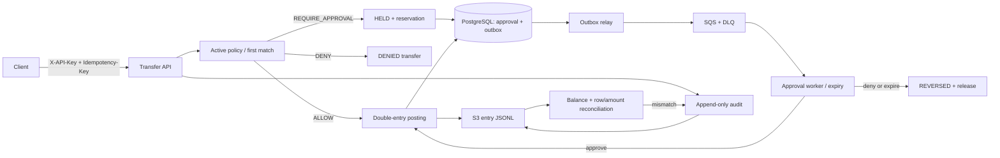

# Teller

Teller is a Java 21/Spring Boot payments core with a policy gate. It keeps money as signed-safe `long` minor units plus an ISO-4217 currency code, posts transfers through a double-entry ledger, and routes policy-sensitive transfers through four-eyes approval over SQS.

The original policy machinery remains part of the service: ordered first-match rules with default deny, immutable decisions, approvals, append-only audit, transactional outbox, idempotent SQS consumption, DLQ replay, date-partitioned S3 entry/audit export, and reconciliation.

## Correctness model

- An account caches ledger and available balances and carries a JPA `@Version`.
- A hold reduces only available balance. Approval turns the reservation into a ledger debit without subtracting available twice; denial or expiry releases it.
- Posting writes a positive debit row and a positive credit row. Demo deposits are also balanced postings: a customer credit and an external funding debit with no account. PostgreSQL deferred constraint triggers compute `CREDIT - DEBIT` for every affected posting and transfer at commit and reject a non-zero result; posted transfers must contain a complete posting.
- Reversing a posted transfer writes compensating credit/debit entries. Reversing a held transfer releases its reservation without inventing ledger entries.
- Money movement locks both account rows in UUID order and re-checks funds after locking. Concurrent transfers therefore serialize without deadlock or lost updates and cannot overdraw available balance.



## API

All routes except `/actuator/health` require `X-API-Key`.

| Method | Path | Purpose |
|---|---|---|
| `POST` | `/accounts` | Open an account in one ISO currency |
| `GET` | `/accounts/{id}` | Read balances, status, and version |
| `POST` | `/accounts/{id}/deposits` | Add demo funding in account currency |
| `POST` | `/transfers` | Evaluate the active policy and create a transfer; requires `Idempotency-Key` |
| `GET` | `/transfers/{id}` | Read transfer, decision, approval, and timestamps |
| `POST` | `/transfers/{id}/reverse` | Release a hold or compensate a posted transfer |
| `POST` | `/policies` | Create and activate a policy version |
| `POST` | `/policies/{id}/rules` | Add an ordered rule with tool, money, velocity, currency, counterparty, or four-eyes matchers |
| `POST` | `/decisions` | Use the retained generic policy-gate API; requires `Idempotency-Key` |
| `GET` | `/decisions/{id}` | Read an immutable decision and matched rule |
| `POST` | `/approvals/{id}/approve` | Approve and post a held transfer |
| `POST` | `/approvals/{id}/deny` | Deny and release a held transfer |
| `GET` | `/audit?from=&to=` | Query append-only audit records |
| `POST` | `/admin/exports/audit?date=` | Export a UTC audit day to S3 |
| `POST` | `/admin/exports/daily?date=` | Export UTC entry and audit JSONL partitions to S3 |
| `POST` | `/admin/reconciliation?date=` | Export and reconcile a UTC day immediately |
| `GET` | `/admin/reconciliation/latest` | Read the latest persisted reconciliation result |
| `POST` | `/admin/dlq/replay?limit=` | Replay up to ten approval DLQ messages |

Transfer rules use `toolNameGlob: "ledger.transfer"`. Money fields are inclusive `amountMin`/`amountMax`; `fourEyesAbove` is exclusive; velocity requires both `velocityMax` and `velocityWindowSeconds`. All amounts are minor units. A counterparty in both lists is denied. Lower precedence numbers run first, and no match is a deny.

## Compose walkthrough

Prerequisites: Docker Compose, `curl`, `jq`, and `uuidgen`.

```bash
export POSTGRES_USER=teller
export POSTGRES_PASSWORD='choose-a-local-password'
export TELLER_API_KEY='choose-a-local-api-key'
docker compose up --build -d --wait
curl --fail http://localhost:8080/actuator/health
```

Compose starts `teller-postgres`, `teller-localstack`, and `teller-app`. LocalStack creates `teller-approvals`, `teller-approvals-dlq`, and `teller-audit`.

Create two USD accounts and fund the source with 30,000 minor units ($300.00):

```bash
export SOURCE_ID="$(curl --fail-with-body -sS -X POST http://localhost:8080/accounts \
  -H "X-API-Key: $TELLER_API_KEY" -H 'Content-Type: application/json' \
  -d '{"currency":"USD"}' | jq -r '.id')"
export DESTINATION_ID="$(curl --fail-with-body -sS -X POST http://localhost:8080/accounts \
  -H "X-API-Key: $TELLER_API_KEY" -H 'Content-Type: application/json' \
  -d '{"currency":"USD"}' | jq -r '.id')"

curl --fail-with-body -sS -X POST "http://localhost:8080/accounts/$SOURCE_ID/deposits" \
  -H "X-API-Key: $TELLER_API_KEY" -H 'Content-Type: application/json' \
  -d '{"amountMinor":30000}' | jq
```

Create the active policy. It denies amounts above 10,000 first, holds amounts above 5,000 for four-eyes review, and allows amounts through 5,000:

```bash
export POLICY_ID="$(curl --fail-with-body -sS -X POST http://localhost:8080/policies \
  -H "X-API-Key: $TELLER_API_KEY" -H 'Content-Type: application/json' \
  -d '{"name":"teller-demo","version":1}' | jq -r '.id')"

curl --fail-with-body -sS -X POST "http://localhost:8080/policies/$POLICY_ID/rules" \
  -H "X-API-Key: $TELLER_API_KEY" -H 'Content-Type: application/json' \
  -d '{"toolNameGlob":"ledger.transfer","amountMin":10001,"currency":"USD","effect":"DENY","precedence":10}' | jq
curl --fail-with-body -sS -X POST "http://localhost:8080/policies/$POLICY_ID/rules" \
  -H "X-API-Key: $TELLER_API_KEY" -H 'Content-Type: application/json' \
  -d '{"toolNameGlob":"ledger.transfer","fourEyesAbove":5000,"currency":"USD","effect":"REQUIRE_APPROVAL","precedence":20}' | jq
curl --fail-with-body -sS -X POST "http://localhost:8080/policies/$POLICY_ID/rules" \
  -H "X-API-Key: $TELLER_API_KEY" -H 'Content-Type: application/json' \
  -d '{"toolNameGlob":"ledger.transfer","amountMax":5000,"currency":"USD","effect":"ALLOW","precedence":30}' | jq
```

Post an allowed 4,000-unit transfer, then a denied 12,000-unit transfer:

```bash
export ALLOW_TRANSFER_ID="$(curl --fail-with-body -sS -X POST http://localhost:8080/transfers \
  -H "X-API-Key: $TELLER_API_KEY" -H "Idempotency-Key: $(uuidgen)" \
  -H 'Content-Type: application/json' \
  -d "{\"fromAccountId\":\"$SOURCE_ID\",\"toAccountId\":\"$DESTINATION_ID\",\"amountMinor\":4000,\"currency\":\"USD\",\"initiatedBy\":\"demo-maker\"}" \
  | tee /dev/stderr | jq -r '.id')"

curl --fail-with-body -sS -X POST http://localhost:8080/transfers \
  -H "X-API-Key: $TELLER_API_KEY" -H "Idempotency-Key: $(uuidgen)" \
  -H 'Content-Type: application/json' \
  -d "{\"fromAccountId\":\"$SOURCE_ID\",\"toAccountId\":\"$DESTINATION_ID\",\"amountMinor\":12000,\"currency\":\"USD\",\"initiatedBy\":\"demo-maker\"}" | jq
```

Create a 6,000-unit four-eyes transfer. Its response is `HELD`, and source available balance falls from 26,000 to 20,000 while ledger balance remains 26,000:

```bash
export HELD_JSON="$(curl --fail-with-body -sS -X POST http://localhost:8080/transfers \
  -H "X-API-Key: $TELLER_API_KEY" -H "Idempotency-Key: $(uuidgen)" \
  -H 'Content-Type: application/json' \
  -d "{\"fromAccountId\":\"$SOURCE_ID\",\"toAccountId\":\"$DESTINATION_ID\",\"amountMinor\":6000,\"currency\":\"USD\",\"initiatedBy\":\"demo-maker\"}")"
echo "$HELD_JSON" | jq
export HELD_TRANSFER_ID="$(echo "$HELD_JSON" | jq -r '.id')"
export APPROVAL_ID="$(echo "$HELD_JSON" | jq -r '.approvalId')"

curl --fail-with-body -sS "http://localhost:8080/accounts/$SOURCE_ID" \
  -H "X-API-Key: $TELLER_API_KEY" | jq
curl --fail-with-body -sS -X POST "http://localhost:8080/approvals/$APPROVAL_ID/approve" \
  -H "X-API-Key: $TELLER_API_KEY" -H 'Content-Type: application/json' \
  -d '{"decidedBy":"demo-checker"}' | jq
curl --fail-with-body -sS "http://localhost:8080/transfers/$HELD_TRANSFER_ID" \
  -H "X-API-Key: $TELLER_API_KEY" | jq
```

After approval, source ledger/available are both 20,000 and destination ledger/available are both 10,000. Reverse the approved transfer; compensating entries restore source to 26,000 and destination to 4,000:

```bash
curl --fail-with-body -sS -X POST "http://localhost:8080/transfers/$HELD_TRANSFER_ID/reverse" \
  -H "X-API-Key: $TELLER_API_KEY" -H 'Content-Type: application/json' \
  -d '{"reasonCode":"DEMO_REVERSAL"}' | jq
curl --fail-with-body -sS "http://localhost:8080/accounts/$SOURCE_ID" \
  -H "X-API-Key: $TELLER_API_KEY" | jq
curl --fail-with-body -sS "http://localhost:8080/accounts/$DESTINATION_ID" \
  -H "X-API-Key: $TELLER_API_KEY" | jq

curl --fail-with-body -sS -X POST \
  "http://localhost:8080/admin/reconciliation?date=$(date -u +%F)" \
  -H "X-API-Key: $TELLER_API_KEY" | jq
curl --fail-with-body -sS "http://localhost:8080/admin/reconciliation/latest" \
  -H "X-API-Key: $TELLER_API_KEY" | jq
```

Reusing a transfer `Idempotency-Key` with the same canonical body returns the stored body with HTTP 200; changing that body returns 409.

## Configuration

| Environment variable | Required | Purpose |
|---|---:|---|
| `DB_URL`, `DB_USERNAME`, `DB_PASSWORD` | yes | PostgreSQL connection |
| `TELLER_API_KEY` | yes | Static API credential |
| `TELLER_AWS_ENABLED` | production | Enable SQS/S3 adapters |
| `AWS_REGION` | production | SDK client region |
| `APPROVAL_QUEUE_URL`, `APPROVAL_DLQ_URL` | AWS/local | Exact SQS URLs |
| `AUDIT_BUCKET` | AWS/local | Entry and audit export bucket |
| `AUDIT_EXPORT_ENABLED`, `AUDIT_EXPORT_CRON` | no | Enable nightly export/reconciliation and set its UTC cron |
| `AWS_ENDPOINT_URL` | local only | LocalStack endpoint |
| `APPROVAL_TTL` | no | Hold lifetime; default `PT30M` |
| `IDEMPOTENCY_TTL` | no | Key retention; default `PT24H` |

## Tests and build

Pure tests and compilation run offline without Docker:

```bash
./mvnw -o -q -Dtest='MoneyTest,AccountLedgerTest,TransferStateMachineTest,IdempotencyServiceTest,MoneyRulesEngineProperties,RulesEngineTest,RulesEngineProperties,ApprovalStateMachineTest,SimulationTest,AuditExportServiceTest,EntryExportServiceTest,ReconciliationComparatorTest,ReconciliationServiceTest,S3AuditObjectStoreTest,AwsApprovalQueuePublisherTest,ApprovalMessageCodecTest,ApprovalQueueWorkerTest,OutboxRelayTest,ApprovalMessageValidatorTest,DlqReplayTest,HttpRequestLoggingFilterTest,ApiKeyFilterTest,AwsClientConfigurationTest' -Dsurefire.failIfNoSpecifiedTests=false test
./mvnw -o -q -DskipTests package
```

`SimulationTest` runs 200 deterministic seeds by default, writes its aggregate report to `target/sim-coverage.json`, and prints the same JSON. A single failure is reproducible and the 2,000-seed gate is explicit:

```bash
./mvnw -o -q -Dtest=SimulationTest -Dsim.seed=137 -Dsurefire.failIfNoSpecifiedTests=false test
./mvnw -o -q -Dtest=SimulationTest -Dsim.seeds=2000 -Dsurefire.failIfNoSpecifiedTests=false test
```

During Task C development, the ledger-derived-balance invariant failed immediately for every funded account: deposits changed the cached balance and audit but created no entries. That finding introduced the balanced external/customer deposit posting described above; reconciliation and the simulator now derive customer ledger balances entirely from entries.

Daily export/reconciliation uses immutable per-run objects inside each UTC date partition and a PostgreSQL repeatable-read snapshot. Reconciliation verifies every exported entry's immutable content as well as row counts, per-currency debit/credit totals, and cached account balances.

On a Docker host, the full offline suite adds PostgreSQL and LocalStack tests for balance constraints, each policy path, reservation expiry, transfer idempotency, concurrent draining, S3 entry/audit export, and reconciliation:

```bash
./mvnw -o -q test
```

## Infrastructure

The CDK app retains separate `TellerNetworkStack`, `TellerDataStack`, `TellerQueueStack`, `TellerBucketStack`, `TellerServiceStack`, `TellerBudgetStack`, and `TellerGithubOidcStack` stacks. It uses one small public-subnet Fargate service, private RDS reachability through security groups, SQS/DLQ, S3, Secrets Manager, CloudWatch, and a $10 budget alert.

```bash
cd infra
npx tsc --noEmit
npx cdk synth
```

This is a demo payments core, not a payment rail. KYC, FX, card/bank connectivity, OAuth, multi-region operation, Kafka, and production overdrafts are deliberately out of scope.
